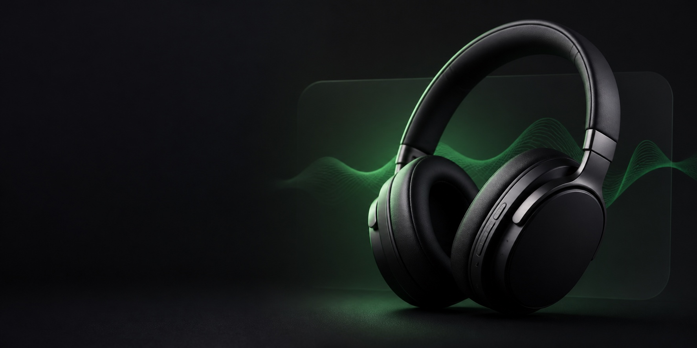

<p align="center">
  
</p>

<h1 align="center">Studio Controller</h1>

<p align="center">
  The missing macOS menu-bar app for <strong>UGREEN Studio Pro (HP206)</strong> headphones.
</p>

<p align="center">
  <a href="https://github.com/sanild/ugreen-studio-controller-macos/actions/workflows/build.yml"></a>
  <a href="https://github.com/sanild/ugreen-studio-controller-macos/releases/latest"></a>
  
  <a href="LICENSE"></a>
</p>

<p align="center">
  <a href="https://github.com/sanild/ugreen-studio-controller-macos/releases/latest/download/Studio-Controller-macOS.zip"><strong>Download Studio Controller →</strong></a>
</p>

---

## One missing Mac app, fixed.

UGREEN made a capable pair of headphones. They just forgot the Mac app.

Studio Controller talks directly to your headphones over Bluetooth, giving you
the controls from UGREEN's phone app without needing a phone, account, cloud
service, or ceremonial Bluetooth re-pairing dance.

## What it controls

| | Controls |
|---|---|
| 🎧 **Listening** | ANC, ambient and off modes; ultra, general, gentle and adaptive ANC strength |
| 🎚️ **Sound** | Eight EQ presets, spatial audio, game mode and wind-noise reduction |
| 🔊 **Prompts** | English voice announcements or beep-only feedback |
| 🖲️ **Buttons** | ANC-button single, double and long press; Volume +/− hold actions |
| 🔗 **Connections** | Dual-device mode |
| 🔋 **Status** | Battery level and firmware version |

> **Power-button reality check:** its actions are fixed by the headphone
> firmware, so they cannot be remapped by Studio Controller or UGREEN's phone
> app.

## Install

1. **[Download the latest release](https://github.com/sanild/ugreen-studio-controller-macos/releases/latest/download/Studio-Controller-macOS.zip)** and unzip it.
2. Move **Studio Controller.app** into your **Applications** folder.
3. Pair and connect **UGREEN Studio Pro** in **System Settings → Bluetooth**.
4. Control-click the app and choose **Open** on first launch.
5. Allow Bluetooth access when macOS asks.

The headphones icon will appear in your menu bar. Click it and enjoy having
buttons where buttons ought to be.

> [!NOTE]
> This independent build is not notarized by Apple, so macOS may ask you to
> confirm the first launch. The app requires macOS 13 Ventura or newer.

## Private by design

Studio Controller communicates locally with your paired headphones. It has:

- no analytics;
- no accounts;
- no network features;
- no background update service.

## Build from source

Install the current Xcode Command Line Tools, clone the repository, then run:

```sh
./scripts/test.sh
./scripts/build-app.sh
```

The packaged app is written to `build/Studio Controller.app`. Every `v*` tag is
also tested, built and published automatically by GitHub Actions.

<details>
<summary>Project notes</summary>

- The original app icon artwork lives in `Assets/AppIcon-master.png`.
- `scripts/build-icon.sh` generates the complete macOS `.icns` resource.
- The standalone protocol test runner avoids depending on XCTest or Swift
  Testing, which are missing from some Command Line Tools distributions.
- Firmware updates and factory reset are deliberately not implemented.

</details>

## Compatibility

The protocol implementation is model-specific and currently supports
**UGREEN Studio Pro (HP206)**. It was derived from UGREEN's published Android
client for interoperability with personally owned hardware.

Have another UGREEN model? Contributions and carefully documented protocol
captures are welcome.

## License and trademarks

Studio Controller is available under the [MIT License](LICENSE).

This project is not affiliated with, authorized by, or endorsed by UGREEN.
UGREEN and Studio Pro are trademarks of their respective owner.
